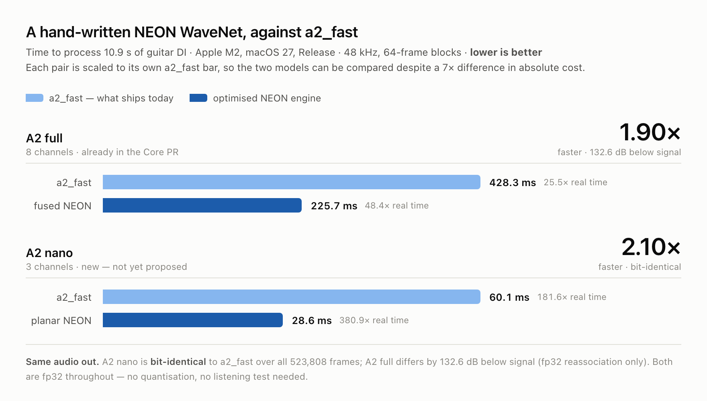
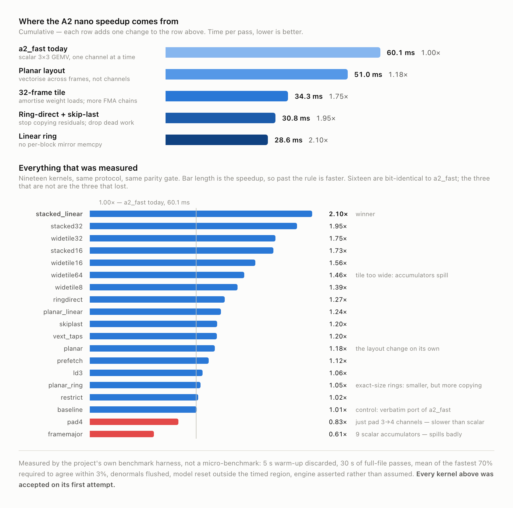

# Draft: NEON WaveNet speedups, A2 full and A2 nano

A ready-to-adapt write-up for [NeuralAmpModelerPlugin#657](https://github.com/sdatkinson/NeuralAmpModelerPlugin/issues/657).
Nothing here has been posted anywhere.

**Before posting:** the image paths below are repo-relative. In a GitHub *issue
comment* they will not resolve — either drag the four PNGs from `charts/` into
the comment box and let GitHub rewrite the URLs, or push this repo and swap in
`https://raw.githubusercontent.com/<you>/<repo>/<sha>/charts/…`. The
`<picture>` blocks give a viewer on GitHub dark mode the dark rendering; if you
paste via drag-and-drop, keep just the light `` and drop the `<source>`.

Two `<!-- FILL -->` markers need your PR numbers.

---

## The numbers

<picture>
  <source media="(prefers-color-scheme: dark)" srcset="charts/nam-speedup-headline-dark.png">
  
</picture>

Two separate pieces of work against `a2_fast`, both hand-written NEON, both fp32:

| | Channels | `a2_fast` | NEON | Speedup | Output |
|---|---:|---:|---:|---:|---|
| **A2 full** | 8 | 428.3 ms | 225.7 ms | **1.90×** | 132.6 dB below signal |
| **A2 nano** | 3 | 60.1 ms | 28.6 ms | **2.10×** | **bit-identical** |

Apple M2, macOS 27, Release, 48 kHz, 64-frame blocks, one pass over 10.9 s of
guitar DI (523,808 frames). Both submodels come from the same
`Ampeg SVT - Gain 10 Ultra Lo and Hi MD 421.nam`.

The A2 full number is the work already in <!-- FILL: Core PR link -->. **The A2
nano number is new** and is not in any PR yet — I wanted the measurements in
front of you before proposing code.

## Why A2 nano is worth doing separately

The fused engine's shape check rejects the nano submodel on one line:

```cpp
if (as.channels % 4 != 0 || as.channels > kMaxChannels) return false;   // fused.cpp
```

Every other requirement is met — nano is `channels == bottleneck == 3`, the same
23 layers, LeakyReLU(0.01) throughout, `layer1x1` active, head `k=16` with bias.
So nano falls through to `a2_fast`'s `if constexpr (Channels == 3)` branch, which
is a fully-unrolled **scalar** 3×3 GEMV: nine scalar FMAs per frame per layer,
with the `z` accumulator making 30 round-trips to memory per frame per K=6 layer.

The first thing anyone tries is deleting that line and padding 3→4 channels so
the existing `Q`-templated kernels apply. **I tried it. It is slower than the
scalar code** — 0.83× — because a quarter of every lane is multiplied by zero and
the ring buffers grow from 172 KB to 230 KB, further past the M2's 128 KB L1D
than they already were.

What works instead is changing which axis is vectorised. `a2_fast` and `fused`
both vectorise across *channels*, which at C=3 wastes a lane before it starts.
The planar kernel keeps three separate channel planes and vectorises across
*frames* — a NEON register holds four consecutive frames of one channel, every
lane does real work, and the weight becomes the scalar operand of the FMA:

| | FMA per frame |
|---|---:|
| `a2_fast` — 9 scalar FMAs | 9 |
| pad 3→4 — one lane wasted | 3 |
| planar — 3 loads + 9 lane-FMAs per 4 frames | 2.25 |

**That is also why it is bit-identical.** Because the weight is the scalar and
the vector is four frames, the reduction order per output channel — bias, then
tap 0 inputs 0/1/2, then tap 1, and so on — is *exactly* `a2_fast`'s scalar
chain, one lane per frame. Nothing is reassociated. Same for the head
convolution. So this is a drop-in replacement that needs no listening test:
identical `float` output over all 523,808 frames.

## How the 2.10× is built up, and what else was tried

<picture>
  <source media="(prefers-color-scheme: dark)" srcset="charts/nam-nano-detail-dark.png">
  
</picture>

The layout change alone is 1.18×. Most of the rest is the frame-tile width —
32 frames per tile, which amortises the weight loads (three weight vectors per
tap feed 24 FMAs instead of 3) and gives the FMA pipes enough independent chains
to stay busy. Then two pieces of work the model never reads, and a cheaper ring.

The lower chart is every kernel I measured, including the ones that lost. Worth
your attention specifically:

- **`pad4` (0.83×)** — the obvious fix, and it does not work; see above.
- **`framemajor` (0.61×)** — nine scalar accumulators for ILP. I expected this to
  win and it came last: that much live scalar state spills, and the spills cost
  more than the memory round-trips they saved.
- **`planar_ring` (1.05×)** — exact-size rings crossing under L1D (172.5 → 110.4 KB).
  Lost badly. An exactly-sized ring for a 5-frame lookback is 69 columns and a
  block advances 64, so nearly every block wraps, and a wrapping read mirrors
  *per tap* rather than per layer. Smallest footprint, most copying.
- **`baseline` (1.01×)** — the control: a verbatim port of `a2_fast`'s 3-channel
  branch compiled into the same harness. It has to land on `a2_fast`'s number or
  nothing else means anything. It does, and it is bit-identical.

## One finding that needs no new code at all

While sweeping `NAM_A2_RING_MODE` I found that **`a2_fast` ships with the slower
of its own two ring modes for this model.** Rebuilding upstream's `a2_fast`
unchanged except for `-DNAM_A2_RING_MODE=0`:

| | `a2_fast` |
|---|---:|
| mode 1 — pow2 + eager tail mirror (**shipped**) | 59.4 ms |
| mode 0 — linear buffer + memmove rewind | **51.9 ms** |

That is **14% for a one-line default change**, no new kernel involved. The cost
is copy traffic, not footprint: mode 1 mirrors all 24 rings unconditionally every
block — about 18 KB of `memcpy` per 64-frame block that in most blocks nothing
reads. At C=8 that is lost in the arithmetic; at C=3 it is not. (My lab kernels
do not read the flag, and their times do not move between the two builds, which
is the control on that measurement.)

**So the honest framing of the headline is two numbers:** the planar kernel is
**2.10×** against `a2_fast` as it ships today, and **1.73×** against `a2_fast`
compiled at its own better setting. The second is the one I would want a new
kernel judged on — I do not think it should get credit for a 14% default that
could be fixed independently.

## What I would propose changing

Confined to `fused.cpp` — no change to `a2_fast`, so it stays byte-identical
between the two checkouts:

1. Relax `parse_spec`'s `channels % 4` check to "is this shape handled by *some*
   kernel family", keeping the existing `Q`-templated family for multiples of
   four and adding a planar family for the rest.
2. The planar family is not C=3-specific: one accumulator register per channel
   per 4-frame lane, with the tile width chosen to keep accumulators in registers
   (roughly `channels × tile / 4 ≤ 24`). C=3 lands on tile 32.
3. Carry the three switches that paid: the wide frame tile, writing each layer's
   residual straight into the next layer's ring instead of through a scratch
   buffer, and skipping the final `layer1x1` (which `fused` already does via
   `skip_l1x1_output`; `a2_fast` does not).

Separately and independently: `a2_fast`'s `NAM_A2_RING_MODE` default is worth
revisiting on its own merits.

I have not opened a PR for any of this yet — happy to, in whatever shape suits
you, or to leave it as a measurement if you would rather the nano path stayed
simple.

## How these were measured

Not a micro-benchmark. Every number above comes from the same harness
(<!-- FILL: NAMBench repo link -->), which:

- builds each variant from its own pinned checkout into its own dynamic
  framework, with identical flags against one shared Eigen tree;
- **asserts which engine the model actually routed to** before measuring, and
  refuses to run on a mismatch — the fork silently falls back to the *generic*
  engine for shapes fused rejects, and reporting that as "fused" would look like
  a catastrophic regression rather than a harness bug;
- runs 5 s of warm-up passes (discarded), then 30 s of full-file passes, and
  accepts a result only when the fastest 70% of samples agree within 3%;
- flushes denormals, resets model state outside the timed region, and runs on a
  `userInteractive` thread so it stays on the P-cores;
- compares every variant's audio against `a2_fast` over the whole file before
  timing anything.

Every kernel in the charts was accepted on its first attempt. Full method,
per-candidate reasoning and the block-size and ring-mode sweeps are in
[`SLIMMED-PATH.md`](SLIMMED-PATH.md).

One caveat on reading small differences: run-to-run spread on this machine is
about ±2%, so anything inside that band is not a difference. `restrict` at 1.02×
is inside it.
