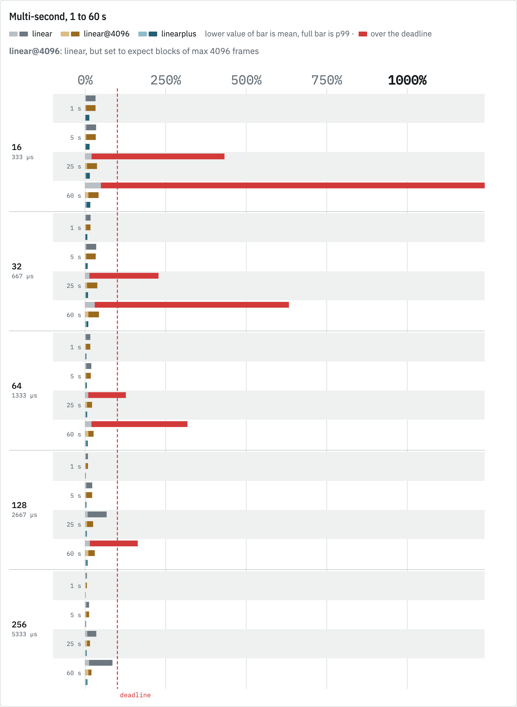
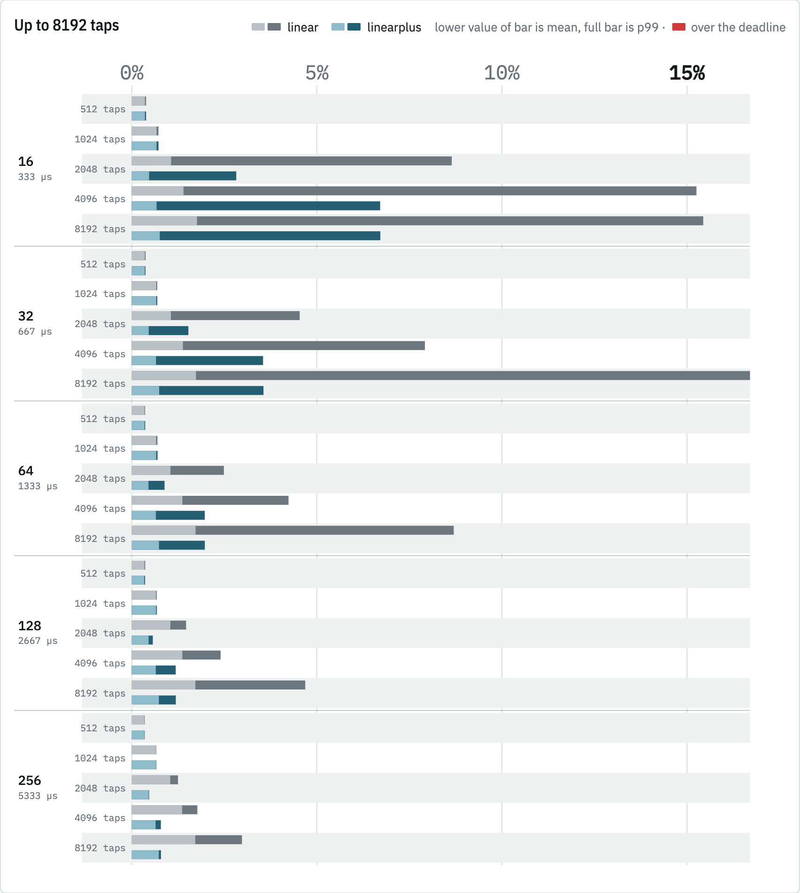
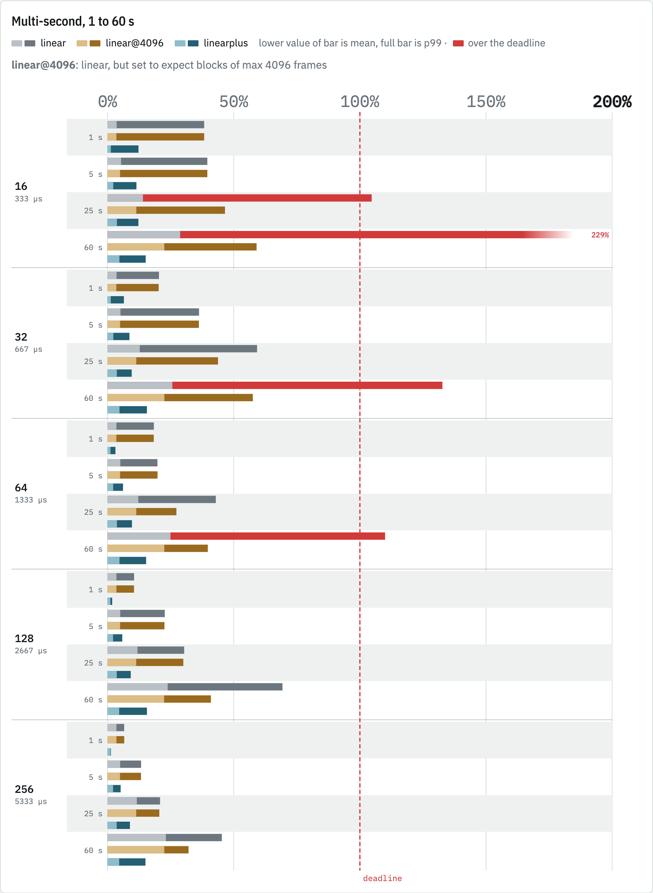
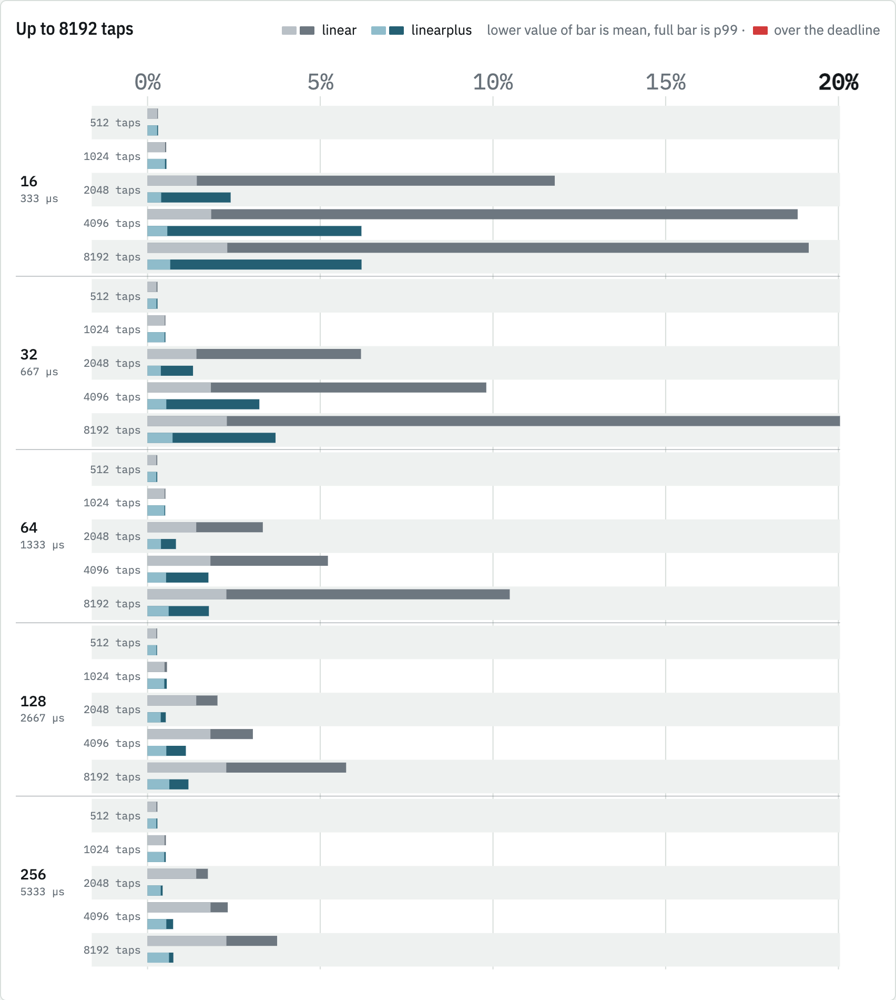
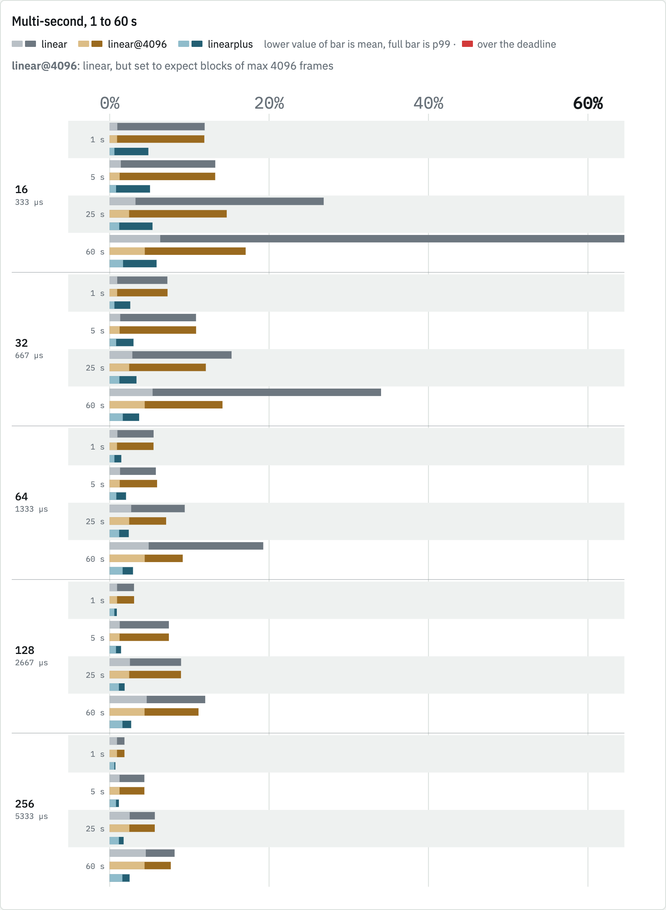
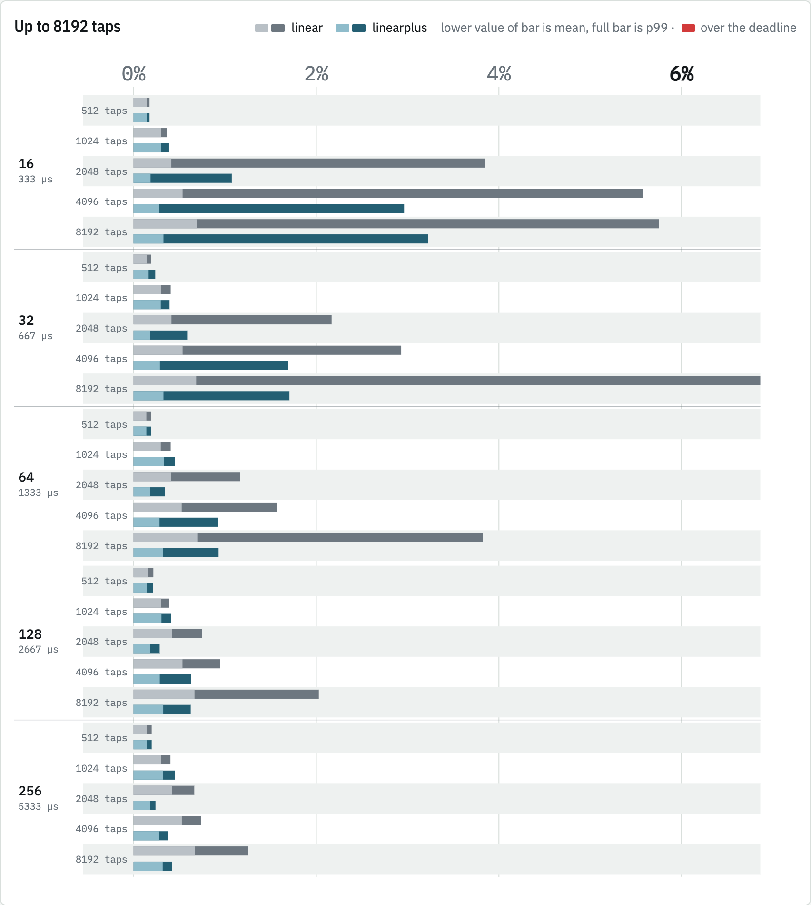

# Draft: Linear FFT path, uniform partitions with a split-transform tail tier

A ready-to-adapt write-up for the `ir-optimisation` commit on
`rikkus/OptimisationWorkOnNeuralAmpModelerCore`, aimed at
`sdatkinson/NeuralAmpModelerCore`. Nothing here has been posted anywhere.

**Before posting:** the image paths below are relative to this file. In a GitHub
comment or PR description they will not resolve. Either drag the PNGs from
`charts/` into the comment box and let GitHub rewrite the URLs, or push this
repo and swap in `https://raw.githubusercontent.com/rikkus/NAMBench/<sha>/ir-study/charts/…`.
The `<picture>` blocks give a viewer in GitHub dark mode the dark rendering; if
you paste by drag-and-drop, keep just the light `` and drop the `<source>`.

In the charts, **linear** is `main` at `0b3d3c9` and **linearplus** is this
change.

---

## Summary

- The FFT path uses **uniform partitions** of 256, 512 or 1,024 taps behind a
  direct head of the same length, so the largest transform any callback runs
  whole is 2,048 points.
- Beyond 48,000 taps, a **tail tier** of 8,192- or 16,384-tap partitions takes
  over at twice its partition size. Its 2T-point transforms are computed as
  several 2B-point transforms plus a combining pass, and every step of a tail
  block's work, transforms included, is spread over the T samples before its
  output is due.
- The FFT path keeps **only the direct head's input history**, so it no longer
  goes through `Buffer`'s receptive-field rewind.
- Spread work is shared out **per callback**, by what remains divided by the
  callbacks left before it is due, rather than advanced per sample per tier.
- Dispatch table re-tuned on the 99th-percentile callback, on an Apple M2 and a
  Raspberry Pi 500, and measured on x86-64 (a Haswell i7) as well.
- Tests for the tail tier: full impulse-response renders at 60,000 and 250,000
  taps, and output independence from how the input is split into callbacks.

## What I found

I was measuring the whole callback-time distribution of `Linear` at 16- to
256-frame callbacks, 512 taps to 60 s, with the host's declared maximum block
equal to its callback size. Three things set the worst callbacks on `main`:

1. **The input buffer rewind.** The FFT path still feeds `Buffer`, which copies
   the whole receptive field back to the start of its buffer every
   32 × `maxBufferSize` samples. At 2,880,000 taps that is 11.5 MB in one
   callback, about 4.4 ms on the Pi. With a 16-frame declared maximum it
   happens every 512 samples, which also dominates the mean at small
   callbacks. The FFT path only ever reads the last `direct_taps` samples of
   that history.
2. **Whole large transforms in one callback.** The tiers double up to 8,192-tap
   blocks. A tier's forward transform runs in the callback where its block
   completes, and its inverse runs in the callback where its multiply job
   finishes, each a 16,384-point real FFT. The half-block phase offsets stop
   tiers from landing together, but each large transform still lands whole in
   one callback, and at 16 or 32 frames those callbacks set the p99.
3. **Per-sample scheduling.** `_advance_fft_jobs` runs per sample, per tier,
   per channel, which costs in the mean even when there is no work to do.

A host can soften (1) by declaring a larger maximum block, since that makes the
copy rarer. The `linear@4096` bars below are `main` with a declared maximum of
4,096 frames. It helps a lot, but not enough: on the Pi, 60 s IRs still miss at
16 and 32 frames, because (2) remains.

## How it works

It is still zero-latency partitioned convolution with a direct head, and the
spectral multiplies are still spread across the callbacks between transforms.
What changes is the partition layout and what is allowed to run whole in one
callback.

**Uniform tier.** The first `B` taps are convolved directly, and taps `B`
onwards are cut into uniform partitions of `B`, each with a `2B`-point real
FFT (half spectrum). A frequency-domain delay line holds the last few input
block spectra. When a block completes, the callback runs one forward FFT per
input channel, partition 0's multiplies (the only ones that needed the new
block), and one inverse FFT per output channel. Partitions 1 onwards only
multiply spectra that already exist, so that work is done in the callbacks in
between: each callback takes what is left divided by the callbacks still to
come before the next transform. The overlap-add happens per output sample as
it is played, from the current and previous inverse transforms, so no callback
pays for all of it. With `B` at most 1,024, the largest transform in any
callback is 2,048 points.

**Tail tier.** Uniform partitions cost `num_partitions` complex multiplies per
sample, which grows with the IR, so past 48,000 taps the uniform tier stops at
`2T` and the rest is cut into partitions of `T` = 8,192 or 16,384 taps. This is
the usual non-uniform constraint: a partition of `T` taps starting at `2T` gets
a whole block period, `T` samples, between its input block completing and its
first output being due. At 60 s this is about 205 complex multiplies per
sample, against about 2,800 for 1,024-tap partitions alone.

The tail's `2T`-point transforms are what must not land in one callback, so
each is split Cooley–Tukey style into `M = 2T / 2B` interleaved phases:

- forward: `M` transforms of `2B` points, one per phase `x[M·n + s]`, then a
  combine per output bin, `X[k] = Σ_s W_N^{sk} X_s[k mod 2B]`;
- inverse: the reverse split per phase and bin, then `M` inverse transforms of
  `2B` points, each written into an output ring at its interleaved positions.

A tail block's job is five stages: forward phase transforms, forward combine,
multiplies, inverse split, inverse phase transforms. Each callback advances it
by a share of its estimated cost (a `2B`-point transform counted as
`(B) log2(2B)` multiply-equivalents), so no callback does more than one
`2B`-point transform beyond its share of arithmetic. Anything left when the
next tail block completes is done then; with regular callbacks nothing is left.

**History.** Each input channel keeps `direct_taps` plus eight maximum-size
callbacks of history. The direct head and the uniform tier's transforms both
read from it, and when it fills, `direct_taps` samples move back to the start.

**Channels.** Work is done per (input, kernel, output) path. Forward transforms
are per input channel and inverse transforms per output channel, so 1-to-N
transforms the input once, and N-to-1 sums in the frequency domain and runs one
inverse.

The sequence of steps and the arithmetic within each step do not depend on
callback sizes, so the output is identical however the input is split into
callbacks.

## Results

[NAMBench](https://github.com/rikkus/NAMBench)'s `nam_ir_benchmark`, 48 kHz,
one process, every callback timed. Five seconds of warm-up passes are
discarded, then timed passes are accepted when the tightest 70% agree within
3%; a cell that was rejected was rerun until it passed. The declared maximum
block is the callback size, except for `linear@4096`. The Pi ran pinned to an
isolated core, as a pedal would; the i7 pinned to one core with the
`performance` governor.
Bars are a percentage of the callback's deadline: the lighter part is the mean,
and the full bar is the p99. Red is over the deadline.

<picture>
  <source media="(prefers-color-scheme: dark)" srcset="charts/pi-long-dark.png">
  
</picture>

<picture>
  <source media="(prefers-color-scheme: dark)" srcset="charts/pi-short-dark.png">
  
</picture>

<picture>
  <source media="(prefers-color-scheme: dark)" srcset="charts/mp-long-dark.png">
  
</picture>

<picture>
  <source media="(prefers-color-scheme: dark)" srcset="charts/mp-short-dark.png">
  
</picture>

<picture>
  <source media="(prefers-color-scheme: dark)" srcset="charts/m2-long-dark.png">
  
</picture>

<picture>
  <source media="(prefers-color-scheme: dark)" srcset="charts/m2-short-dark.png">
  
</picture>

A few points, as % of the deadline (mean / p99):

| Machine | Frames | IR | `main` | `main`, max 4,096 | This change |
|---|---:|---:|---:|---:|---:|
| Pi 500 | 16 | 60 s | 49.0 / 1,240 | 10.1 / 41.6 | **4.4 / 16.1** |
| Pi 500 | 32 | 25 s | 13.1 / 228 | 5.9 / 37.7 | **3.1 / 9.1** |
| Pi 500 | 128 | 60 s | 14.6 / 163 | 10.0 / 29.8 | **4.0 / 7.5** |
| Pi 500 | 16 | 8,192 taps | 1.8 / 15.4 | | **0.8 / 6.7** |
| i7-4770HQ | 16 | 60 s | 28.8 / 229 | 22.5 / 59.1 | **4.7 / 15.1** |
| i7-4770HQ | 32 | 25 s | 12.8 / 59.3 | 11.4 / 43.8 | **3.7 / 9.6** |
| i7-4770HQ | 32 | 8,192 taps | 2.3 / 20.0 | | **0.7 / 3.7** |
| M2 | 16 | 60 s | 6.3 / 64.6 | 4.4 / 17.1 | **1.7 / 5.9** |
| M2 | 32 | 25 s | 2.8 / 15.3 | 2.4 / 12.1 | **1.2 / 3.4** |
| M2 | 32 | 8,192 taps | 0.7 / 6.9 | | **0.3 / 1.7** |

As a cross-check against #324's figures: `main` on the M2 at 32 frames and
1,200,000 taps has a p99 of 102 µs, in line with the 107 µs #324 reports on an
M1. This change's is 22 µs.

Up to 1,024 taps both use direct convolution and measure the same. From 2,048
taps up, this change has the lower mean and p99 at every size and callback
measured, on all three machines. `main` missed deadlines on every machine: on
the Pi at 16 and 32 frames from 5 s IRs up and at every callback size from 16
to 256 frames with a 60 s IR; on the i7 at 16 frames from 1 s up and up to 64
frames at 60 s; on the M2 at 16 and 32 frames with a 60 s IR. `linear@4096`
still missed at 16 frames on all three. This change missed none, in about
600 million timed callbacks.

The difference from `main`'s output is 137 to 138 dB below the signal
everywhere measured: float rounding from a different partitioning, not a
difference in the filter.

## Validation

- Complete Core test suite, Release build, on macOS arm64 and on Linux x86-64
  (Ubuntu 24.04, GCC 13).
- The same suite under AddressSanitizer and UndefinedBehaviorSanitizer (clang
  18, x86-64), with leak detection on: clean. To run at all under ASan, the
  test harness's `malloc`/`free` override in
  `tools/test/allocation_tracking.cpp` had to be compiled out (it recurses
  through `dlsym` during ASan's start-up), and its two self-tests skipped;
  `operator new`/`delete` tracking stays.
- New: impulse-response renders through the tail tier at 60,000 and 250,000
  taps, with impulses at 0 and 32,345, under callback patterns `{16}`, `{37}`,
  `{256}`, `{20000}` and `{1, 300, 7}`.
- Callback-independence test extended to 60,000 taps and a 20,000-frame
  callback: identical output for every split.
- Dispatch assertions for the new table and tail sizes.
- The plugin (`NeuralAmpModelerPlugin` main) builds and links against this
  change, app and AU, universal. It needs its Xcode project to list the Core
  sources added since the Core it pins (`linear.cpp`, `nam_file.cpp`,
  `sequential.cpp`, `wav.cpp`), which is so for `main` as well.

## Trade-offs and caveats

- **Not bit-identical to `main`.** The difference is 137 dB below the signal, but anything
  that compares rendered output byte for byte against `main` will see a
  difference.
- **Tuned on arm64.** The dispatch table was chosen on an Apple M2 and a
  Raspberry Pi 500 (Cortex-A76). On x86-64 it is better than `main` in every
  cell measured, but it was not tuned there, and the partition sizes are the
  part most likely to benefit from it.
- **More code.** `linear.cpp` grows by about 430 lines, most of it the tail
  tier. The split transform's combine and inverse split are hand-written
  around Eigen's FFT.
- **More arithmetic in the tail transforms than a single FFT.** The combine is
  `M` complex multiplies per bin, 16 at `T` = 16,384, where a radix-16 FFT
  stage would need fewer. That is the price of steps small enough to spread,
  and it is still small next to the tail's multiplies.
- **The cost model is an estimate.** Tail work is shared out by estimated cost,
  not measured time. It keeps the tail's spread even on both machines, but it
  is a heuristic.
- **Irregular callbacks.** Spread work assumes the callbacks until the next
  deadline look like the current one. If they do not, whatever is left runs
  when the result is due, so a sudden switch from large to small callbacks can
  put up to one uniform block's multiplies, or the rest of one tail job, into
  one callback. A callback of `B` frames or more always does all its uniform
  work in that callback.
- **Callbacks larger than the declared maximum** grow the history, which
  allocates on the audio thread, as `Buffer` does in the same case.
- **Memory is about the same** at the long end: about 46 MB of kernel and input
  spectra for a mono 60 s IR, like `main`'s 8,192-tap tier. `Linear` still
  sizes `Buffer`'s input history (receptive field + 32 × maximum block), which
  the FFT path does not read, 11.5 MB at 60 s. Dropping it would mean changing
  how `Linear` uses `Buffer`, so I have left it for a separate change.
- **Measurement caveats.**
  - The M2's and the i7's maximum callback times are dominated by OS
    pre-emption for every variant, up to 63% and 54% of the deadline for
    this change against a p99 under 16%; I read those as scheduling, not
    work. None of them missed a deadline.
  - The declared maximum equal to the callback size is the worst case for
    `main`'s rewind. A host that declares a larger maximum sees less of (1),
    which the `linear@4096` bars show.
